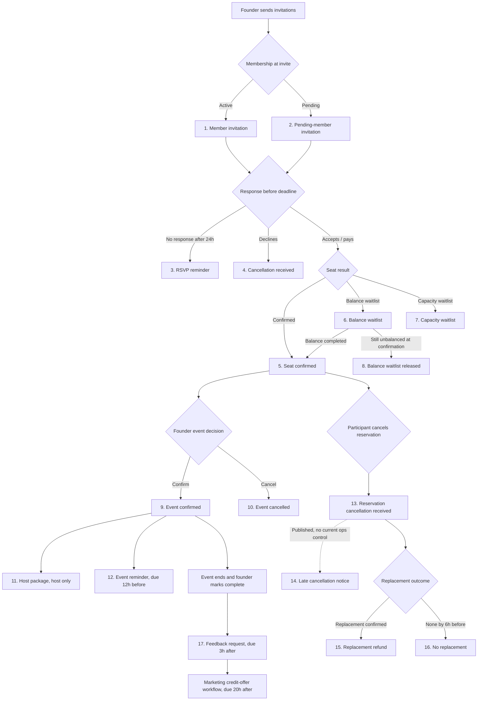

# Event email sequence and published English copy

Last updated: 2026-07-20

## Purpose

This is the review inventory for the emails used by the event lifecycle. It
combines the actual application and ops dispatch rules with the English content
currently published in the `one plus one club` Loops team.

The event system has:

- 17 operational transactional email types with published English templates;
- four current English drafts with changes that have not been published or
  sent yet;
- one post-event promotional credit offer sent through a Loops Workflow event,
  not a transactional template; and
- several branches, so no recipient receives every email in this document.

The main copy below is a snapshot of the **published** Loops messages, meaning
the versions that can be sent in production. The separate draft section records
the newer unpublished changes without presenting them as already sent.

## How to read the sequence

All timing is advisory in ops. Nothing is scheduled automatically; a founder
must trigger each due ops action. Member-response emails are sent immediately
by the app.

### Ordered send map

| Order | Email type | Recipient and trigger | Timing / branch |
| ---: | --- | --- | --- |
| 1 | `invitation_member` | Active member in the frozen invitation cohort | Founder sends invitations at `invitation_send_at` |
| 2 | `invitation_pending` | Pending member in the frozen invitation cohort | Alternative to order 1, in the same founder action |
| 3 | `rsvp_reminder` | Invitee whose response is still `invited` | Due 24 hours after invitation; cannot be sent after the RSVP deadline |
| 4 | `cancellation_received` | Invitee who declines; also currently reused when leaving a balance waitlist after its credit was returned | Immediate member-action result |
| 5 | `seat_confirmed` | Accepted member whose seat is confirmed | Immediate member/payment result; may also follow promotion from a waitlist |
| 6 | `waitlist_balance` | Accepted member waiting for the balancing participant | Immediate member/payment result; reserves one credit |
| 7 | `waitlist_capacity` | Accepted member with no seat because capacity is full or a payment hold expired | Immediate member/payment result; does not spend a credit |
| 8 | `waitlist_balance_released` | Paid/active balance-waitlisted member still unbalanced when the event is confirmed | Sent during the founder confirmation action; credit is returned |
| 9 | `event_confirmed` | Confirmed attendees | Founder confirms the event and releases venue details, due at the RSVP deadline |
| 10 | `event_cancelled` | Recipients whose event invitation was opened | Stop branch available while the event is draft, inviting, or confirmed |
| 11 | `host_package` | Confirmed attendee assigned as host | Founder assigns the host after confirmation |
| 12 | `event_reminder` | Confirmed attendees | Due 12 hours before the event |
| 13 | `reservation_cancellation_received` | Confirmed attendee or accepted waitlisted member who cancels their reservation | Immediate member-action result |
| 14 | `late_cancellation_notice` | Cancelling member with a replacement record still marked eligible | Published, but no dedicated current ops action exposes this send |
| 15 | `replacement_refund` | Cancelling member after a replacement is confirmed | Founder records replacement; credit is returned when eligible |
| 16 | `no_replacement` | Cancelling member when no replacement is found | Due 6 hours before the event; founder records the outcome |
| 17 | `feedback_request` | Confirmed, non-cancelled attendee who has not submitted feedback | Event must be marked complete; due 3 hours after event end |
| Separate | `credit_offer` | Feedback-complete, marketing-eligible attendee | Loops Workflow event due 20 hours after event end; not transactional |

The replacement branch can happen before or after the event reminder, depending
on when the participant cancels and when a replacement is confirmed. The club
cancellation branch can stop the normal sequence at any point before completion.

## Shared content in all 17 transactionals

All 17 are styled English messages with sender name `one plus one club`, sender
local part `hello` on the team's configured sending domain, and no explicit
reply-to address.

Every published English transactional uses the same Loops theme and surrounds
the email-specific content below with:

1. A dynamic greeting image whose visible fallback/alt text is:
   `Dear {data.firstName},`
2. A signature image whose visible fallback/alt text is:
   `one plus one club`
3. This final paragraph:

> P.S. You can follow us on Instagram
> [@oneplusone_club](https://www.instagram.com/oneplusone_club?utm_source=friends-email)

The individual content blocks below omit only blank layout spacers and the
repeated shared wrapper above. Wording, punctuation, variables, emphasis, and
button labels are preserved from the published LMX.

## Published English email content

### 1. Member invitation

- **Email type:** `invitation_member`
- **Transactional ID:** `cmrs2pk0z32kh0jxz33ihef3f`
- **Published message ID:** `cmrt6wcvb020j0jy3cqk8tbvw`
- **Unpublished draft exists:** Yes
- **Subject:** `Event invitation`
- **Preview:** *(empty)*

**Content**

> Exciting news! We found someone special for you to meet
> {data.eventIntro}!
>
> Based on what you've shared with us, we've matched you with a group of people
> who have these things in common:
>
> Location: {data.city} 
> Date language: {data.eventLanguage} 
> Date format: {data.eventFormat} on {data.eventDate} at {data.eventTime} 
> Age range: {data.ageRange} 
> Looking for: {data.majorityIntention}
>
> In order to find out what else you have in common, please respond to the
> invite by clicking "Attend" on the event profile.
>
> **Button:** `RSVP` → `{data.ctaUrl}`
>
> We will wait for your response by {data.rsvpDeadline}. If you decide to go,
> 1 credit will be charged. Venue and number of guests will be revealed once
> the group has been confirmed.

### 2. Pending-member invitation

- **Email type:** `invitation_pending`
- **Transactional ID:** `cmrs2pkig01i10jyuqc4rwood`
- **Published message ID:** `cmrt7d4cm02xo0ix1c4v17gm9`
- **Unpublished draft exists:** Yes
- **Subject:** `Event invitation: complete your membership`
- **Preview:** `Your profile matched a group. Complete payment to reserve.`

**Content**

> Exciting news! We found someone special for you to meet
> {data.eventIntro}!
>
> Based on what you've shared with us, we've matched you with a group of people
> who have these things in common:
>
> Location: {data.city} 
> Date language: {data.eventLanguage} 
> Date format: {data.eventFormat} on {data.eventDate} at {data.eventTime} 
> Age range: {data.ageRange} 
> Looking for: {data.majorityIntention}
>
> To reserve a seat, you can complete your membership application by clicking
> the button below.
>
> **Button:** `View invitation` → `{data.ctaUrl}`
>
> We will wait for your response by {data.rsvpDeadline}. The venue and number of
> guests will be revealed once the group has been confirmed.

### 3. RSVP reminder

- **Email type:** `rsvp_reminder`
- **Transactional ID:** `cmrs2pmtn01xi0j19wphnmk51`
- **Published message ID:** `cmrs3lihf00020jzrmr2keus1`
- **Unpublished draft exists:** No
- **Subject:** `Event invitation reminder`
- **Preview:** *(empty)*

**Content**

> Your group is waiting. Please make sure to respond to the event invitation by
> {data.rsvpDeadline} to secure your spot.
>
> **Button:** `RSVP` → `{data.ctaUrl}`

### 4. Cancellation received

- **Email type:** `cancellation_received`
- **Transactional ID:** `cmrs2pmd501ww0jz12tb2byqh`
- **Published message ID:** `cmrs3lgtj000w0jzl4pmfr69m`
- **Unpublished draft exists:** No
- **Subject:** `Not this time`
- **Preview:** *(empty)*

**Content**

> We're sorry you won't be able to join us for this event.
>
> The good news is that we create new groups every week, so we're confident
> you'll receive another invitation before long.
>
> We look forward to inviting you again soon!

### 5. Seat confirmed

- **Email type:** `seat_confirmed`
- **Transactional ID:** `cmrs2pkxk33nf0j123zfdk4rd`
- **Published message ID:** `cmrs3lbs3000n0j158ypqxeac`
- **Unpublished draft exists:** No
- **Subject:** `It's a date!`
- **Preview:** *(empty)*

**Content**

> We saved you a seat! Thanks for confirming your attendance!
>
> We're now waiting for everyone else in the group to respond. On **Thursday**,
> we'll send you all the details, including the venue and everything you need
> to know.
>
> In the meantime, enjoy your week. And if you're wondering how to prepare,
> don't overthink it. Just come as yourself. The best conversations usually
> happen when you're simply being natural.
>
> **Button:** `View event` → `{data.ctaUrl}`

### 6. Balance waitlist

- **Email type:** `waitlist_balance`
- **Transactional ID:** `cmrs2plen009l0j1fxd63afhx`
- **Published message ID:** `cmrt6gzgt01280jyb950r1e54`
- **Unpublished draft exists:** Yes
- **Subject:** `We’re balancing your table`
- **Preview:** `Your application is saved and 1 credit is reserved while we complete the group.`

**Content**

> Thanks for applying to join this event. To keep the table balanced, we're
> waiting for one more person to join the group.
>
> We've reserved **1 credit** while we wait. As soon as the matching person
> joins, your seat will be confirmed automatically and that credit will remain
> assigned to the event.
>
> If we can't complete the balance, we'll release your place and return the
> credit automatically. You don't need to do anything.
>
> **Button:** `View event` → `{data.ctaUrl}`

### 7. Capacity waitlist

- **Email type:** `waitlist_capacity`
- **Transactional ID:** `cmrs2plv31dbp0j1j06lmxwke`
- **Published message ID:** `cmrs3lf2u000u0jzlwe6m9npw`
- **Unpublished draft exists:** Yes
- **Subject:** `Your event update`
- **Preview:** *(empty)*

**Content**

> We're sorry to let you know that this event has reached full capacity.
> You've been placed on the waiting list, and we'll notify you if a spot becomes
> available.
>
> You can choose to remain on the waiting list or remove yourself if you no
> longer wish to receive an invitation for this event.
>
> **Button:** `View event` → `{data.ctaUrl}`
>
> The good news is that we create new groups every week, so we're confident
> you'll receive another invitation before long.
>
> We look forward to inviting you again soon!

### 8. Balance waitlist released

- **Email type:** `waitlist_balance_released`
- **Transactional ID:** `cmrt6gzhp012l0jvpll9x9uyx`
- **Published message ID:** `cmrt6gzhn012k0jvp5ofaqtqe`
- **Unpublished draft exists:** No
- **Subject:** `Your reserved credit is available again`
- **Preview:** `Your balance-waitlist place was released and your credit was returned automatically.`

**Content**

> Your place on the gender-balance waitlist has now been released.
>
> The **1 credit** reserved for this event has been returned automatically and
> is available in your account again.
>
> We'll keep looking for another group that fits you and hope to invite you
> again soon.
>
> **Button:** `View your events` → `{data.ctaUrl}`

### 9. Event confirmed

- **Email type:** `event_confirmed`
- **Transactional ID:** `cmrs2pn8n036l0j0v38y73qo5`
- **Published message ID:** `cmrs3lk4h000y0j01tnzpusi7`
- **Unpublished draft exists:** No
- **Subject:** `Date confirmation`
- **Preview:** *(empty)*

**Content**

> Yet another exciting update! Your group has been confirmed!
>
> Details below
>
> Venue: {data.venueName}
>
> Address: {data.venueAddress}
>
> Date and time: {data.eventDate}, {data.eventTime}
>
> Event language: {data.eventLanguage}
>
> Updated age range: {data.ageRange}
>
> Majority intention: {data.majorityIntention}
>
> {data.eventInstructions}
>
> Please arrive on time. At the restaurant, please mention you're there for the
> **one plus one club** booking. If you cancel late, your credit is returned only
> if a replacement is found.
>
> **Button:** `View event` → `{data.ctaUrl}`

### 10. Event cancelled

- **Email type:** `event_cancelled`
- **Transactional ID:** `cmrs2pnok01jb0j2xq3x3fawd`
- **Published message ID:** `cmrs3llpx2vc20j2x6a90qxil`
- **Unpublished draft exists:** No
- **Subject:** `Your event has been cancelled`
- **Preview:** `We couldn't go ahead with this event. Your event credit has been returned.`

**Content**

> We're sorry to let you know that this event has been cancelled because
> {data.cancellationReason}.
>
> Any event credit used for this reservation has been returned automatically.
>
> We know this is disappointing. We'll keep looking for a suitable group for
> you and hope to invite you again soon.
>
> **Button:** `View event update` → `{data.ctaUrl}`

### 11. Host package

- **Email type:** `host_package`
- **Transactional ID:** `cmrs2po5s01un0j0lsi4cr6dn`
- **Published message ID:** `cmrs3lnbi00240j1fgevfcqk4`
- **Unpublished draft exists:** No
- **Subject:** `Date confirmation: you're the host`
- **Preview:** `Your group is confirmed and the Hosting Playbook is ready.`

**Content**

> Yet another exciting update! Your group has been confirmed! And you will be
> their host!
>
> Details below
>
> Venue: {data.venueName}
>
> Address: {data.venueAddress}
>
> Date and time: {data.eventDate}, {data.eventTime}
>
> Event language: {data.eventLanguage}
>
> We'd love to create a fun, welcoming, and connected experience for everyone.
> To help make that happen, we've put together a simple Hosting Playbook, which
> is also available in the app.
>
> As a host, please follow these guidelines:
>
> **Before the event:** please familiarise yourself with **the Hosting
> Playbook** and write down or print out the questions provided for the joint
> event activity.
>
> **At the event:**
>
> - **Please arrive 5 minutes before everyone.**
> - **For mixed tables:** Encourage guests to alternate seating (male, female,
>   male, female, and so on).
> - **Before ordering food:** Invite everyone to briefly introduce themselves,
>   by starting first.
> - **With the first drink:** Start the conversation by introducing the light
>   questions (sharing time questions provided, to be drawn individually and
>   passed on to someone else to answer).
> - **After the meal:** Move on to the spicier questions to keep the
>   conversation flowing (spicy time questions provided, to be drawn
>   individually and answered by the same person).
>
> Our goal is to make sure everyone has a chance to participate, share their
> stories and have a chance to shine. Encourage everyone to join in, but if
> someone isn't comfortable answering a particular question, they can simply
> draw another one instead.
>
> Please remind everyone not to exchange phone numbers during the event. We
> want to preserve a little mystery and ensure everyone feels comfortable. If
> people would like to stay in touch, they can connect through the app after
> the event.
>
> At the restaurant, please mention you're there for the **one plus one club**
> booking. If you cancel late, your credit is returned only if a replacement
> is found.
>
> **Button:** `View Hosting Playbook` → `{data.materialUrl}`

### 12. Event reminder

- **Email type:** `event_reminder`
- **Transactional ID:** `cmrs2poko03b80jzlali9brv2`
- **Published message ID:** `cmrs3lp4k040c0jzc327geou9`
- **Unpublished draft exists:** No
- **Subject:** `Your date is coming up ⏰`
- **Preview:** *(empty)*

**Content**

> Just a quick reminder that your **one plus one** event starts soon, on
> {data.eventDate} at {data.venueName}, {data.city}, at {data.eventTime}.
>
> We look forward to welcoming you!
>
> **Button:** `View event` → `{data.ctaUrl}`

### 13. Reservation cancellation received

- **Email type:** `reservation_cancellation_received`
- **Transactional ID:** `cmrt70cwq02ep0iv7zaew1zck`
- **Published message ID:** `cmrt70cwn02eo0iv7d0jeudf7`
- **Unpublished draft exists:** No
- **Subject:** `We received your cancellation`
- **Preview:** `Your reservation update and what happens next.`

**Content**

> We've received your cancellation and updated your place for this event.
>
> **What happens now** 
> {data.cancellationOutcome}
>
> **Reason recorded:** {data.cancellationReason}
>
> **Button:** `View your events` → `{data.ctaUrl}`

The `{data.cancellationOutcome}` value is generated by the app and resolves to
one of these exact English messages:

- **`not_spent`:** "We have removed you from the waitlist. No credit was used."
- **`refunded`:** "The credit reserved for this place has been returned to your
  account automatically."
- **`replacement_pending`:** "Your credit stays assigned while we look for
  someone to take your place. If we confirm a replacement, we will return it
  automatically and email you. If we cannot find one, we will let you know six
  hours before the event, and you can still attend."

The `{data.cancellationReason}` value resolves to `Not feeling well`, `My plans
changed`, `No longer interested in this event`, or `Something else` (with
`Another reason` as the fallback).

### 14. Late cancellation notice

- **Email type:** `late_cancellation_notice`
- **Transactional ID:** `cmrs2ppwb33ng0j1dw0bannx8`
- **Published message ID:** `cmrs3lu0p03w90j0pxm98zqy3`
- **Unpublished draft exists:** No
- **Subject:** `We're looking for a replacement`
- **Preview:** `Your late cancellation is recorded. We'll update you about the credit.`

**Content**

> We've recorded your late cancellation for this event.
>
> We're now looking for another participant to take your place. If a
> replacement is confirmed, your event credit will be returned automatically.
> If no replacement is found, the credit will remain used.
>
> We'll send you another update before the event.
>
> **Button:** `View event` → `{data.ctaUrl}`

### 15. Replacement refund

- **Email type:** `replacement_refund`
- **Transactional ID:** `cmrs2pp170miy0j0025gaqeed`
- **Published message ID:** `cmrs3lqtc05mx0j36p6xg1uwl`
- **Unpublished draft exists:** No
- **Subject:** `Your replacement was found`
- **Preview:** `A replacement joined and your event credit has been returned.`

**Content**

> We found someone to take your place at this event.
>
> Your cancellation is complete and your event credit has been returned
> automatically. You can see the updated balance in the app.
>
> You are no longer included in the attendee list and messaging for this event
> will not be enabled for you.
>
> **Button:** `View your credits` → `{data.ctaUrl}`

### 16. No replacement

- **Email type:** `no_replacement`
- **Transactional ID:** `cmrs2ppfi00a30jzb2xgjnrut`
- **Published message ID:** `cmrs3lsfj00180j2mwyn3l3cp`
- **Unpublished draft exists:** No
- **Subject:** `We couldn't find a replacement`
- **Preview:** `Your seat was not replaced, so the event credit remains used.`

**Content**

> We're sorry, but we couldn't find someone to take your place before the
> event.
>
> Because the seat was not replaced, your event credit has not been returned
> automatically.
>
> You remain marked as cancelled and messaging for this event will not be
> enabled for you.
>
> If your plans have changed and you may still be able to attend, open the
> event now. Availability and the final attendee list may have changed.
>
> **Button:** `View event` → `{data.ctaUrl}`

### 17. Feedback request

- **Email type:** `feedback_request`
- **Transactional ID:** `cmrs2pqbo039i0jzaxctucsfx`
- **Published message ID:** `cmrs3lvmd002q0jzswozrui18`
- **Unpublished draft exists:** No
- **Subject:** `How was your event?`
- **Preview:** `Share feedback to unlock private messaging with the group.`

**Content**

> We hope you enjoyed meeting the group.
>
> Your feedback helps us improve future events and is required before private
> messaging is unlocked.
>
> You'll be asked to rate the event overall, the questions, the hosting
> experience, and the restaurant. If any rating is one star, we'll ask for a
> little more detail.
>
> After you submit feedback, you can send one private first message to each
> confirmed participant. If they reply, the conversation can continue.
>
> **Button:** `Share feedback` → `{data.ctaUrl}`

## Current unpublished English drafts

These four drafts contain the small updates made after the published versions.
They are not used by production sends until they are published in Loops. The
shared greeting, signature, and Instagram P.S. remain unchanged unless noted.

### Draft: member invitation

- **Email type:** `invitation_member`
- **Draft message ID:** `cmrtem21s022n0jxk0zcwapbt`
- **Subject:** `Event invitation` *(unchanged)*
- **Preview:** *(empty; unchanged)*
- **Change from published:** Adds a Going-out preference message after the
  Instagram P.S.

**Current draft content**

> Exciting news! We found someone special for you to meet
> {data.eventIntro}!
>
> Based on what you've shared with us, we've matched you with a group of people
> who have these things in common:
>
> Location: {data.city} 
> Date language: {data.eventLanguage} 
> Date format: {data.eventFormat} on {data.eventDate} at {data.eventTime} 
> Age range: {data.ageRange} 
> Looking for: {data.majorityIntention}
>
> In order to find out what else you have in common, please respond to the
> invite by clicking "Attend" on the event profile.
>
> **Button:** `RSVP` → `{data.ctaUrl}`
>
> We will wait for your response by {data.rsvpDeadline}. If you decide to go,
> 1 credit will be charged. Venue and number of guests will be revealed once
> the group has been confirmed.
>
> *The shared signature and Instagram P.S. appear here.*
>
> If you don't want to receive invitations anymore, you can update your
> Going-out preferences in the app.

### Draft: pending-member invitation

- **Email type:** `invitation_pending`
- **Draft message ID:** `cmrte4knx01ol0jwnzo0xdkc1`
- **Subject:** `Event invitation: complete your membership` *(unchanged)*
- **Preview:** `Your profile matched a group. Complete payment to reserve.`
  *(unchanged)*
- **Change from published:** Adds a tokenized unsubscribe link after the
  Instagram P.S.

**Current draft content**

> Exciting news! We found someone special for you to meet
> {data.eventIntro}!
>
> Based on what you've shared with us, we've matched you with a group of people
> who have these things in common:
>
> Location: {data.city} 
> Date language: {data.eventLanguage} 
> Date format: {data.eventFormat} on {data.eventDate} at {data.eventTime} 
> Age range: {data.ageRange} 
> Looking for: {data.majorityIntention}
>
> To reserve a seat, you can complete your membership application by clicking
> the button below.
>
> **Button:** `View invitation` → `{data.ctaUrl}`
>
> We will wait for your response by {data.rsvpDeadline}. The venue and number of
> guests will be revealed once the group has been confirmed.
>
> *The shared signature and Instagram P.S. appear here.*
>
> **Link:** `Unsubscribe from event invitations` → `{data.unsubscribeUrl}`

### Draft: balance waitlist

- **Email type:** `waitlist_balance`
- **Draft message ID:** `cmrtezxv402fj0jypn28zz1yt`
- **Subject:** `We’re balancing your table` *(unchanged)*
- **Preview:** `We’re waiting for one more person to join before confirming your seat.`
- **Changes from published:** Replaces the preview; removes the explicit
  statement that one credit is reserved and remains assigned to the event;
  adds that the member will be notified when the seat is confirmed.

**Current draft content**

> Thanks for applying to join this event. To keep the table balanced, we're
> waiting for one more person to join the group. As soon as the matching person
> joins, your seat will be confirmed automatically and you will be notified.
>
> If we can't complete the balance, we'll release your place and return the
> credit automatically. You don't need to do anything.
>
> **Button:** `View event` → `{data.ctaUrl}`

### Draft: capacity waitlist

- **Email type:** `waitlist_capacity`
- **Draft message ID:** `cmrtf339p00mm0jylyv9h4f2h`
- **Subject:** `Your event update` *(unchanged)*
- **Preview:** *(empty; unchanged)*
- **Changes from published:** Rewrites the opening as a neutral confirmation
  and removes the paragraph about remaining on or leaving the waitlist.

**Current draft content**

> This is confirmation that you are on the waitlist. This event has reached
> full capacity, and we'll notify you if a spot becomes available.
>
> **Button:** `View event` → `{data.ctaUrl}`
>
> The good news is that we create new groups every week, so we're confident
> you'll receive another invitation before long.
>
> We look forward to inviting you again soon!

## Separate marketing email: post-event credit offer

This send is intentionally not one of the 17 transactionals above.

- **Delivery record type:** `credit_offer`
- **Loops event name:** `postEventCreditOffer` (configured through
  `LOOPS_EVENT_POST_EVENT_CREDIT_OFFER`)
- **Eligibility:** confirmed seat, feedback submitted, and marketing eligible
- **Due:** 20 hours after event end
- **Offer policy:** three credits for EUR 30; expires 48 hours after it starts
- **Subject / preview / content:** owned by the Loops Workflow and not exposed
  by the current CLI inventory, so no copy is recorded here as if it were a
  transactional template

## Review flags visible from the sequence

These are inventory observations, not proposed edits:

1. Seven of the 17 subjects have empty preview text.
2. `invitation_member`, `invitation_pending`, `waitlist_balance`, and
   `waitlist_capacity` have unpublished changes recorded above. Publishing them
   will replace the corresponding production versions in the sent snapshot.
3. `late_cancellation_notice` is published and selectable by the database
   delivery contract, but the current ops control centre has no dedicated
   action that sends it.
4. `cancellation_received` now covers more than its copy suggests: it is used
   for an invitation decline and can also acknowledge a voluntarily released
   balance-waitlist place after a refund.
5. `reservation_cancellation_received` and `late_cancellation_notice` overlap:
   both acknowledge a confirmed-seat cancellation and explain the replacement
   search.
6. `no_replacement` invites the cancelled member to open the event if they may
   still attend. The app has a restore action, but its database rule only
   permits restoration before the RSVP deadline, while this email is due six
   hours before the event. At its intended send time, the suggested recovery
   path is therefore normally closed.
7. The repeated Instagram link still uses the onboarding attribution
   `utm_source=friends-email`, not an event-specific source.

## Source of truth used for this snapshot

- Published and draft subject, preview, body, message IDs, and draft presence:
  live Loops CLI reads from the `one plus one club` team on 2026-07-20.
- Transactional ID map: `ops/src/lib/events/email.ts` and
  `app/src/lib/event-email-delivery.ts`.
- Recipient branches and due times: `ops/src/lib/events/policy.ts`.
- Member-action sends and variables: `app/src/lib/event-email-delivery.ts`.
- Delivery-type contract and cancellation/replacement behavior: Supabase event
  migrations in `app/supabase/migrations`.
